<h1 style="width: 50%; margin: auto; text-align: center;"> Github Duolingo Stats</h1>
<br />
<div style="display: flex; justify-content: center; gap: 1rem;">
<a href="https://github.com/ashleytdavis/github-duolingo-widget/graphs/contributors">
      
</a>
<a href="https://github.com/ashleytdavis/github-duolingo-widget/issues">
      
</a>
<a href="https://github.com/ashleytdavis/github-duolingo-widget/pulls">
      
</a>
</div>
<br />

Table of Contents:
- <a href="#about" style="color:rgb(65, 194, 76);">About</a>
- <a href="#usage" style="color: rgb(65, 194, 76);;">Usage</a>
- <a href="#how-to-start-the-development-environment" style="color: rgb(65, 194, 76);">How to Start the Development Environment</a>
- <a href="#making-contributions" style="color: rgb(65, 194, 76);">Making Contributions</a>
- <a href="#project-author" style="color: rgb(65, 194, 76);">Project Author</a>
- <a href="#thanks" style="color:rgb(65, 194, 76);">Thanks</a>
<br />
<br />

## About
Heavily inspired by projects such as <a href="https://github.com/anuraghazra/github-readme-stats" style="color:rgb(65, 194, 76);">github readme stats</a>, the github duolingo widget allows github users to display some of their basic duolingo stats on their github profile READMEs.

## Usage
Copy and paste this into your markdown, and that's it. Simple!

Change the `?username=` value to your Duolingo username.
```

```
<details> 
    <summary>Example </summary>
    
</details>


### Dark Mode Theme
You can pass a query parameter `&darkMode=` to enable or disable dark mode.
```

```
<details> 
    <summary>Example </summary>
    
</details>


## How to Start the Development Environment
I've done my best to make it really easy to run this project locally. The client runs on port 3000 and the server on port 3001.
- Client
    - Navigate to the client directory: `cd client`
    - Install dependencies: `npm install`
    - Start: `npm start`

Rinse and repeat for the `server` directory. Note that both the client and server need to be ran in seperate terminal instances simultaneously.

## Making Contributions
- I encourage users to add their own contributions to this project! Here is best practice for doing so:
    - Ensure you follow the <a href="/ContributorCovenant.md" style="color: rgb(65, 194, 76);">Contributor Covenant</a>
    - Make an <a href="https://github.com/ashleytdavis/github-duolingo-stats/issues" style="color: rgb(65, 194, 76);">issue</a>
    - Make a branch off of the `main` branch named with a _clear_ and _succinct_ branch name (no more than 30 characters)
    - Ensure your commit messages are <a href="https://www.freecodecamp.org/news/how-to-write-better-git-commit-messages/#https://www.freecodecamp.org/news/how-to-write-better-git-commit-messages/#heading-5-steps-to-write-better-commit-messages:~:text=5%20Steps%20to%20Write%20Better%20Commit%20Messages" style="color:rgb(65, 194, 76);">professional and clear</a>
    - When you're ready, open up a <a href="https://github.com/jekhi5/NorthStar/pull" style="color: rgb(65, 194, 76);">pull request</a> (PR)

## Project Author
This project was designed and developed by Ashley Davis. Feel free to connect on other platforms such as <a href="https://www.linkedin.com/in/ashleytdavis/" style="color:rgb(65, 194, 76);">LinkedIn</a>, or feel free to contact me via email ashley921davis@gmail.com.

## Thanks
Thank you to <a href="https://www.duolingo.com/" style="color:rgb(65, 194, 76);">Duolingo</a> for creating a free platform where users can explore new languages =)
